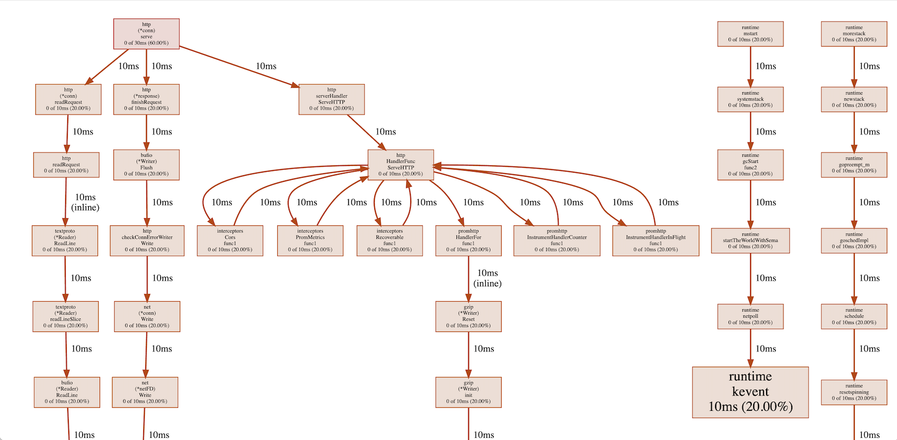
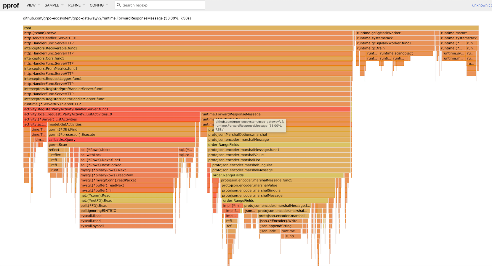

# Golanger
[](https://goreportcard.com/report/jiandahao/golanger) [](https://github.com/jiandahao/golanger/blob/master/LICENSE)
Tools set for developing better service.

## Build docker image
```bash
docker build -f Dockerfile -t golanger:v1.0.0 .
```

## Generate goreport card

```bash
docker run --rm -it -v $(pwd):/source -w /source golanger:latest goreportcard-cli -v
```


```bash
Grade: A+ (92.3%)
Files: 23
Issues: 7
gofmt: 100%
go_vet: 100%
gocyclo: 100%
golint: 95%
        pkg/common/errors.go
                Line 17: warning: exported const OK should have comment (or a comment on this block) or be unexported (golint)
license: 0%
```

> **Note**:  following directories / files won't be checked:
>
> - Directories named "Godeps", "vendor", "third_party" or "testdata" 
> - Files named with suffix ".pb.go", ".pb.gw.go", ".generated.go", "bindata.go" or "_string.go"
> - Files with first line eqauls to "code generated", "generated", "autogenerated", "@generated", "code autogenerated", or "auto-generated"


## Analyzing your service

```bash
docker run --rm -it golanger:latest pprof_proxy "http://127.0.0.1:8080/debug/pprof/profile?second=60"
```

after running, you will get output as following:
```
Running web UI, visit: <your host addr>:<your host port>
 e.g 192.168.1.12:8085 
 do not use localhost or 127.0.0.1 

Listening and serving Web UI on 127.0.0.1:8085
```

visit <your_host_addr>:8085 (e.g 192.168.1.12:8085) using your broswer, and start to optimize your code.








## Testing with mysql
Testing your serivce under real mysql environment.
- writing your unit test
```go
import (
    "fmt"
    "testing"

    "gorm.io/driver/mysql"
	"gorm.io/gorm"
    "github.com/jiandahao/golanger/pkg/mysqltest"
)

func TestMyUnit(t *testing.T) {
    mysqltester, _ = mysqltest.NewMysqltester()
    mysqltester.MustExec(`CREATE DATABASE if not exists test;`)

    mysqltester.Query(`show databases`)

    // get a datasource name string that is appropriate for connecting to the database instance.
    dsn := mysqltester.DSN()
    fmt.Println(dsn)

    gorm.Open(mysql.Open(dsn), &gorm.Config{})
}
```

- running unit test

running unit test inside container:
```bash
docker run --rm -it -v $(pwd):$(pwd) -w $(pwd) golanger:v1.0.0 bash -c go test -v ./...
```

- running unit test by [run_unit_test.sh](scripts/run_unit_test.sh) script
```bash
Usage: 
./scripts/run_unit_test.sh [module_relative_path] [func_to_test]

Example:
- ./scripts/run_unit_test.sh
- ./scripts/run_unit_test.sh pkg/mysqltest
- ./scripts/run_unit_test.sh pkg/mysqltest TestMysqltester
```

## Generates method stubs
[`impler`](cmd/impler) generates method stubs for implementing an interface or extracting an interfacce. It's based on [`impl`](https://github.com/josharian/impl)

Installation:
```bash
go get -u github.com/jiandahao/golanger
go install github.com/jiandahao/golanger/impler
```

Sample usage:

- implementing an interface
```bash
$ impler 'f *File' iface io.ReadWriteCloser
func (f *File) Read(p []byte) (n int, err error) {
	panic("not implemented")
}

func (f *File) Write(p []byte) (n int, err error) {
	panic("not implemented")
}

func (f *File) Close() error {
	panic("not implemented")
}

# You can also provide a full name by specifying the package path.
# This helps in cases where the interface can't be guessed
# just from the package name and interface name.
$ impl 's *Source' golang.org/x/oauth2.TokenSource
func (s *Source) Token() (*oauth2.Token, error) {
    panic("not implemented")
}
```

- extracting an interface
```bash
$ impler myinterface struct time.Ticker

type myinterface interface {

	// Stop turns off a ticker. After Stop, no more ticks will be sent.
	// Stop does not close the channel, to prevent a concurrent goroutine
	// reading from the channel from seeing an erroneous "tick".
	Stop()

	// Reset stops a ticker and resets its period to the specified duration.
	// The next tick will arrive after the new period elapses.
	Reset(d time.Duration)
}
```

You can use `impler` from VSCode with [vscode-go-impl-methods](https://github.com/jiandahao/vscode-go-impl-methods) plugin.

## Validate Go Template
[`impler`](cmd/impler) is a simple tool to validate a go template and visually show where validation errors are happening. 
For example, we got a template string: 
```bash
type {{ .Name.ToCamel }}Model struct {
		{{ range .Fields }}
			{{- .Name.ToCamel } {{.DataType}} ` + "`gorm:\"column:{{ .Name.Source }}\"`" + ` {{if .Comment }}// {{.Comment}} {{end}}
		{{ end -}}
	}
```
after validating it by templare_validator, we'll get result as following:
```bash
type {{ .Name.ToCamel }}Model struct {
        {{ range .Fields }}
                {{- .Name.ToCamel } {{.DataType}} `gorm:"column:{{ .Name.Source }}"` {{if .Comment }}// {{.Comment}} {{end}}
                    ↑ unexpected "}" in operand
        {{ end -}}
    }
```


[Reference]: https://github.com/apexskier/go-template-validation

## Converts JSON string into Go structure
[`jsongen`](cmd/jsongen) is a useful tool that receives a JSON string and then coverts it into go structure

for example:
```bash
jsongen -s '{
                "city":["beijing", "shanghai"],
                "cotunry":"china",
                "countryCode":"CN",
                "age":12,
                "users": [{"name":"jian", "age":24}],
                "jobs":{
                        "name":"jobname"
                }
        }'


type Generated struct {
        Age         float64  `json:"age,omitempty"`
        Users       []User   `json:"users,omitempty"`
        Jobs        Jobs     `json:"jobs,omitempty"`
        City        []string `json:"city,omitempty"`
        Cotunry     string   `json:"cotunry,omitempty"`
        CountryCode string   `json:"countryCode,omitempty"`
}
type User struct {
        Name string  `json:"name,omitempty"`
        Age  float64 `json:"age,omitempty"`
}
type Jobs struct {
        Name string `json:"name,omitempty"`
}
```

## Generator for gin service
[protoc-gen-golangergin](cmd/protoc-gen-golangergin) is a protoc plugin which is helpful to generate gin service code. Examples are available [here](cmd/protoc-gen-golangergin/example).

protoc-gen-golangergin use field's trailing comments to specify the extra strcut tags. It's useful to integrate with other serializers that use reflect. For instance:

```protobuf
// get user profile request
message GetProfileRequest {
	string user_id = 1;// uri:"user_id" form:"user_id" validate:"required"
	string create_time = 2; // form:"create_time"
	string token = 3; // header:"token"
}
```

### installation & usage
go install github.com/jiandahao/golanger/cmd/protoc-gen-golangergin

protoc --golangergin_out=. -I. *.proto
